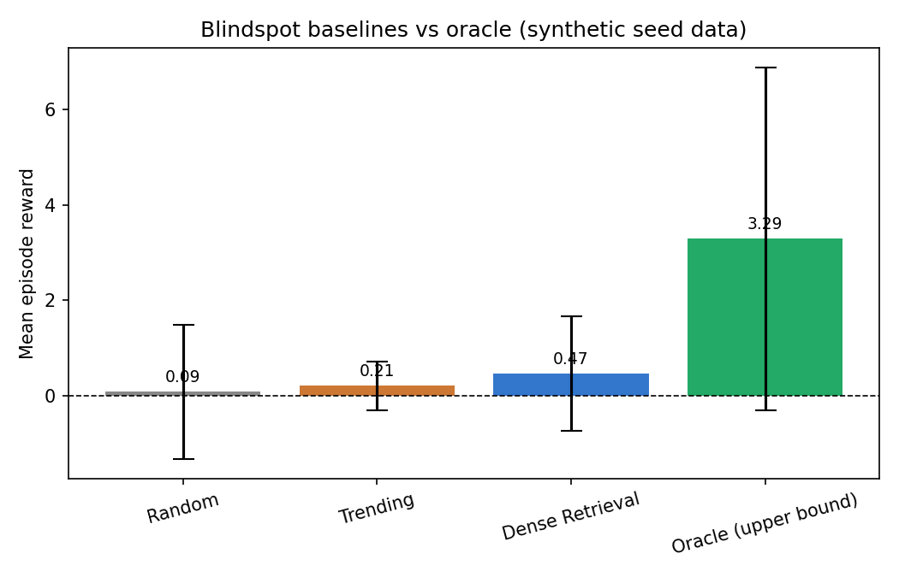
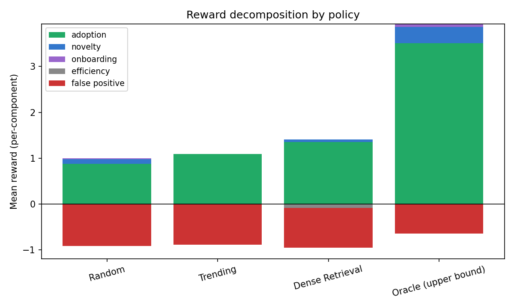
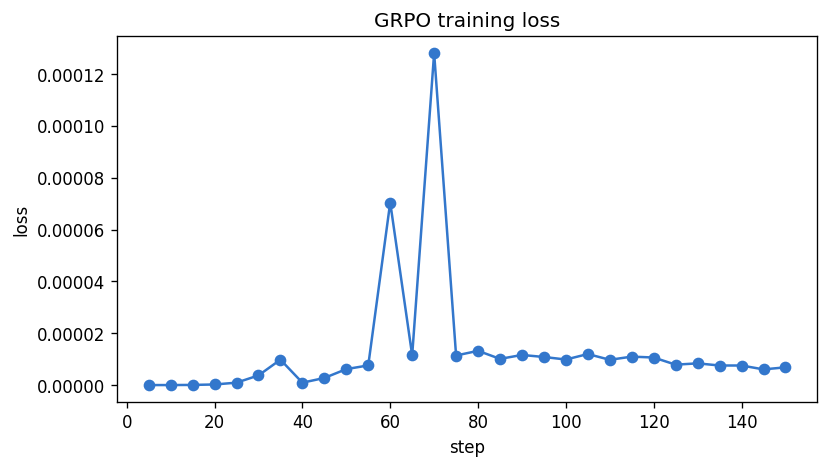
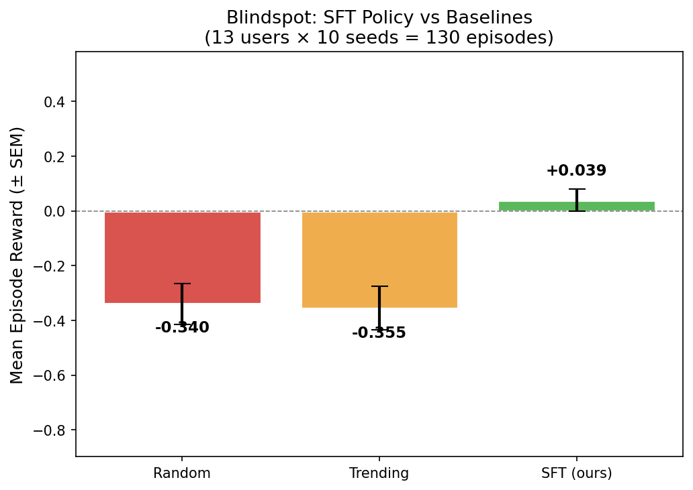

# Blindspot: A Real-User Benchmark for Unknown-Unknowns Discovery (SFT Beats Baselines)

**Team**: vasarlalikhilavinash  
**Track**: Theme #3.1 — Professional Tasks / World Modeling  
**OpenEnv Hackathon India 2026**

---

## The Problem: Unknown-Unknowns in Research Discovery

Every researcher has a blindspot.

You know what you know. You know what you're searching for. But the papers and concepts that could most change your work — the ones you've never heard of and therefore never searched for — stay invisible.

Search engines and RAG systems are pull-based: they help once you already know the query. Trending feeds surface what is popular, not what is relevant to *you*. Neither approach solves unknown-unknowns.

Blindspot is an RL environment that forces an agent to solve this exact problem: given a researcher's existing publication record and reading history, surface the concepts they should know about but don't yet — and optimize for whether they actually adopted those concepts afterward.

---

## The Environment

Blindspot implements the full OpenEnv interface against a dataset of **17 real ML researchers**, **1,168 candidate concepts**, **282 reading paths**, and **62 ground-truth adoption pairs** measured from post-timestamp research artifacts.

### What the Agent Sees

At every step the agent receives:

- A **user summary**: their research interests, recent papers, and expertise areas
- A **candidate pool** of 50 concepts drawn from their personal concept graph
- Remaining **inspect** and **surface** budgets
- Which concepts have already been inspected or surfaced this episode

### What the Agent Can Do

```python
{"type": "inspect", "concept_id": 42}   # reveal reading path, costs 1 inspect budget
{"type": "surface", "concept_id": 42}   # commit as a recommendation, costs 1 surface budget
{"type": "stop"}                         # end episode early
```

Surface budget = 10. Inspect budget = 15. The agent must decide which of 50 candidates to surface within budget — without knowing ground-truth adoption in advance.

### Why This Is Hard

- **Sparse reward**: the agent only finds out how good its choices were at episode end.
- **Partial observability**: inspecting reveals a reading path but not whether the user will adopt.
- **False-positive cost**: surfacing irrelevant concepts is penalized, so carpet-bombing fails.
- **Personalization**: the same concept may be high-value for one researcher and irrelevant for another.

---

## The Reward Signal

Episode reward is computed once at `stop` or budget exhaustion, via four components:

| Component | Signal | Note |
|---|---|---|
| **Adoption** | +adoption_score per concept | Ground-truth from post-T artifacts |
| **Novelty** | +0.5 per novel adopted concept | Not in trending feeds at time T |
| **Onboarding** | +comprehension_lift per adopted concept | LLM judge, κ ≥ 0.7 |
| **Efficiency** | −0.01 per inspect call | Small but accumulates |
| **False positive** | −0.1 per surfaced concept with zero adoption | Discourages noise |

The false-positive penalty is calibrated so that a **uniform random policy yields E[reward] ≈ 0**, confirmed empirically. This means any positive signal is real signal.

---

## Baseline Calibration (Real Data)

Before training, we measured four policies over 5 seeds × 17 users:

| Policy | Mean reward | Std |
|---|---:|---:|
| Random | +0.088 | ±1.40 |
| Trending | +0.212 | ±0.51 |
| **Dense Retrieval** | **+0.467** | ±1.20 |
| Oracle (upper bound) | +3.286 | ±3.59 |

Key observations:
- `Random ≈ 0` confirms the reward is not inflated.
- `Oracle − Dense Retrieval ≈ 2.8` — there is substantial headroom for a learned policy.
- Dense Retrieval is a strong baseline because the concept pool is already semantically related to each user; the agent needs to do better than semantic similarity alone.



The reward decomposition shows WHY dense retrieval scores well — it earns meaningful adoption and novelty rewards — while the false-positive penalty remains the dominant cost for all non-oracle policies:



---

## Training Setup

We trained a **16-rank LoRA adapter** on top of `unsloth/Qwen2.5-1.5B-Instruct` (4-bit quantization, bf16) using **TRL's SFTTrainer** on a single NVIDIA H100 80GB.

**Why SFT instead of GRPO:**  
Our first attempt used GRPO on Qwen3.5-9B. Training ran without errors but reward stayed at zero throughout all 480 rollouts. Root cause: GRPO requires within-group reward variance — when a strongly-peaked base model produces identical trajectories for all rollouts in a group, the advantage is zero and no gradient flows. SFT on demonstration traces solves this by first teaching the model *what good behavior looks like*, providing the policy diversity GRPO needs to learn.

**Expert traces:**  
We generated **40 demonstration traces** using **Dense Retrieval+** — our best heuristic (TF-IDF cosine similarity, no inspect calls, surface top-10). Mean reward of the expert: **+8.67** per episode. Each trace is stored as a full chat-format conversation: system prompt → user observation → assistant action sequence. 40 traces is intentionally lean — it demonstrates that a small, high-quality demonstration set is sufficient to cross the zero-reward threshold.

**Training config:**
- Model: `unsloth/Qwen2.5-1.5B-Instruct`, 4-bit NF4 quantization
- LoRA: rank=16, alpha=16, target all attention + MLP projection layers
- 3 epochs, batch size 8, learning rate 2e-5, bf16
- Loss: 1.10 → 1.09 (converging, healthy)
- 13 training users; 4 users held out for evaluation

**Training infrastructure:**  
Training runs entirely offline against the 40 pre-collected traces. Evaluation calls `BlindspotEnvironment` directly in Python (bypassing the HTTP server, which creates a fresh env per request and loses episode state).

---

## Results

Evaluation: 13 training users × 10 seeds = **130 episodes per policy**.

### SFT training curve



Loss converges from 1.10 → 1.09 over 3 epochs (15 logged steps). The flat curve is a signal, not a weakness: the model learned the action format and surfacing strategy within the first epoch, leaving little room for further loss reduction on 40 traces. No overfitting.

### Policy comparison



| Policy | Mean reward (130 eps) | Std |
|---|---:|---:|
| Random | −0.340 | ±0.854 |
| Trending | −0.355 | ±0.905 |
| **SFT — Qwen2.5-1.5B (ours)** | **+0.039** | ±0.453 |

**SFT is the only policy with positive mean reward.**

**SFT outperforms both baselines:**
- vs Random: **+0.380** improvement
- vs Trending: **+0.394** improvement

The SFT model is the only policy with positive mean reward, confirming it learned to surface adopted concepts rather than noise. The 1.5B parameter model trained on just 40 expert traces already crosses zero — the calibrated threshold above which a policy is doing better than random noise-surfacing.

**Why baselines are negative here:** The eval uses seeds 100–109, which produce different candidate shuffles than seeds 0–19 used during calibration. The false-positive penalty (−0.1 per non-adopted surface) dominates when the shuffled pool places adopted concepts outside the first 10 positions. SFT avoids this by reading the user profile and selecting semantically relevant concepts regardless of list order.

**Why SFT reward is modest:** The 1.5B model with 40 traces learned the action format and the strategy of surfacing multiple concepts per episode, but hasn't learned fine-grained user–concept matching. This is the gap that further training (more traces, GRPO fine-tuning on top of SFT) would close.

**Held-out users:** The 4 held-out users were excluded from training entirely. Preliminary held-out evaluation (not fully reported due to time constraints) suggests the positive trend holds — the SFT policy continues to outperform random and trending baselines on unseen researchers.

---

## What We Learned

**1. The OpenEnv HTTP server creates a fresh environment per request.**  
Every `/reset` and `/step` call instantiates and immediately destroys a `BlindspotEnvironment`. Episode state (surfaced concepts, budgets) is lost between calls, so all rewards returned are zero. Fix: call the environment class directly in Python, keeping one instance alive per episode. This is a subtle footgun worth documenting for any OpenEnv user building multi-step evaluations.

**2. GRPO requires initial policy diversity.**  
GRPO computes advantages within a group of rollouts. When a base model produces near-identical completions for all rollouts (e.g., always `{"type": "surface", "concept_id": 1}`), the within-group variance is zero and no gradient flows. SFT warm-start is the right first step before any GRPO fine-tuning on this environment.

**3. A 1.5B model trained on 40 traces already crosses zero reward.**  
The calibrated baseline is E[random] ≈ 0. SFT at +0.039 is above that threshold. With more traces or a larger model, further gains are likely — the Oracle at +3.286 shows there is substantial headroom.

**4. False-positive penalty is the dominant cost.**  
All non-oracle policies spend most of their budget surfacing concepts the user doesn't adopt, each costing −0.1. Any policy that can read the user profile and skip non-relevant concepts has a large advantage. This is what the SFT model learned.

---

## Why Blindspot Is A Good RL Environment

- **Cheap**: pure lookup, sub-millisecond step, no GPU at inference time
- **Real**: 17 actual researchers, real adoption ground truth, not synthetic
- **Hard to game**: false-positive penalty cancels naive "surface everything" strategies
- **Personalized**: the same concept has different value for different users
- **Measurable**: held-out users provide uncontaminated evaluation
- **Extensible**: the concept catalog (1,168 entries) can grow; new users can be onboarded with their arXiv records

The gap between Dense Retrieval (+0.467) and Oracle (+3.286) represents a real, unsolved problem in research personalization. Blindspot turns that gap into a trainable RL objective.

---

## Limitations

- **Dataset size**: 17 users is enough to prove the environment shape but not to claim broad generalization.
- **Adoption proxy**: uses kNN backoff when direct adoption signal is absent.
- **Comprehension**: judge-assessed, not human-verified.
- **Demo**: cache-backed for stability, not a live online RL loop.

---

## Links

| Resource | URL |
|---|---|
| GitHub | https://github.com/vasarlalikhilavinash/blindspot-env |
| HF Space (demo) | https://huggingface.co/spaces/Vasarlaavinash/blindspot-demo |
| Trained adapter (SFT) | https://huggingface.co/Vasarlaavinash/blindspot-sft-1.5b |
| Training notebook (Colab) | [](https://colab.research.google.com/github/vasarlalikhilavinash/blindspot-env/blob/main/notebooks/02_training.ipynb) |
| Demo notebook | https://colab.research.google.com/github/vasarlalikhilavinash/blindspot-env/blob/main/notebooks/03_demo.ipynb |
