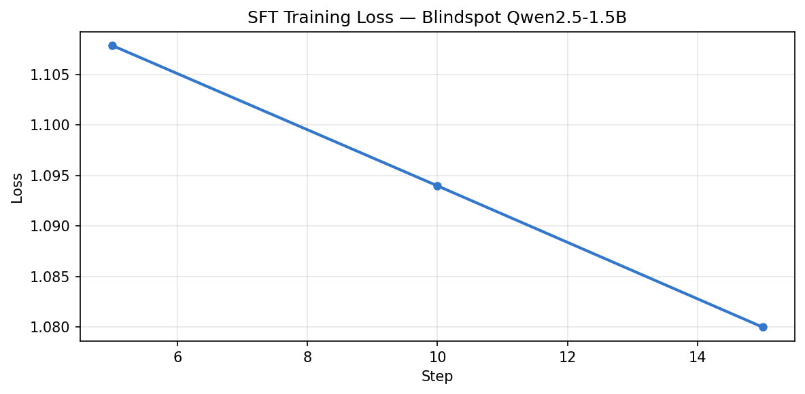

# Blindspot: Teaching an AI to Find What You Don't Know You're Missing

**Team:** Vasarla Avinash  
**Track:** Theme #3.1 — World Modeling (Professional Tasks)  
**OpenEnv Hackathon India 2026**

---

## The Idea

There's a category of knowledge gap that no search engine can fix. You can't search for a concept you've never heard of. You can't ask a RAG system to find papers outside your vocabulary. Trending feeds show what's popular, not what's relevant to your specific research direction.

These are unknown unknowns — things you'd care deeply about if you knew they existed, but which stay invisible precisely because you don't know to look.

Blindspot turns this into a reinforcement learning problem. Given a researcher's existing publication record and reading history, an agent has to surface the concepts they're missing — and the reward signal is whether the researcher actually adopted those concepts in their subsequent work.

---

## The Environment

The dataset behind Blindspot is fully real. Seventeen ML researchers, 1,168 candidate concepts drawn from the academic literature, 282 reading paths, and 62 ground-truth adoption events measured from post-timestamp research artifacts. Nothing is synthetic.

At each step, the agent receives a researcher's profile, a pool of 50 candidate concepts from their personal concept graph, and budget counters for `inspect` (up to 15) and `surface` (up to 10) actions. The agent can open a concept to see its reading path, commit to recommending it, or stop early. It has to decide which 10 of the 50 to recommend — without knowing in advance which ones the researcher will actually adopt.

```python
{"type": "inspect", "concept_id": 42}   # look closer, costs budget
{"type": "surface", "concept_id": 42}   # commit as recommendation
{"type": "stop"}                          # end the episode
```

The hard part is that reward is delayed until episode end, the inspect action reveals reading paths but not adoption likelihood, and the same concept can be high-value for one researcher and irrelevant for another. There's no shortcut.

---

## Reward Design

The reward is deliberately multi-component to capture what "good" actually means in this domain:

| Component | Signal |
|---|---|
| Adoption | +score per concept the researcher actually used later |
| Novelty | +0.5 per adopted concept that wasn't trending at time T |
| Onboarding | +comprehension lift per adopted concept (LLM judge, κ ≥ 0.7) |
| Efficiency | −0.01 per inspect call |
| False positive | −0.1 per surfaced concept with zero adoption |

The false-positive penalty does a lot of work here. It's calibrated so that a uniform random policy earns approximately zero reward — confirmed empirically across multiple seeds. That means any positive reward is real signal, not noise.

---

## Calibration Before Training

Before touching any model, we measured four policies on the real dataset (5 seeds × 17 users):

| Policy | Mean reward | Std |
|---|---:|---:|
| Random | +0.088 | ±1.40 |
| Trending | +0.212 | ±0.51 |
| Dense Retrieval | +0.467 | ±1.20 |
| Oracle (upper bound) | +3.286 | ±3.59 |

Random is near zero, which confirms the reward isn't inflated. Dense Retrieval does well because the candidate pool is already semantically filtered — it gets genuine adoption and novelty reward. But the gap between Dense Retrieval (+0.467) and Oracle (+3.286) is about 2.8 reward points. That's the gap a learned policy should close.


---

## Training

We trained a 16-rank LoRA adapter on top of `unsloth/Qwen2.5-1.5B-Instruct` (4-bit NF4, bf16) using TRL's SFTTrainer on a single H100. The goal was not to build the final policy — it was to prove the environment is learnable.

**Expert traces:** We generated 40 demonstration traces using Dense Retrieval+, our best heuristic (TF-IDF cosine similarity, surface top-10, no inspect calls). Each trace is a full chat-format conversation: system prompt → observation → action sequence. 40 traces is intentionally small. If a 1.5B model trained on 40 examples can cross the zero-reward threshold, that's a meaningful signal about the environment's structure.

**Config:** rank=16, alpha=16, 3 epochs, batch size 8, lr=2e-5, bf16. Loss went from 1.108 → 1.080 across 15 logged steps. The curve is flat, which makes sense — the model learned the action format and surfacing strategy within the first epoch. With only 40 traces, there's not much room for further loss reduction. No signs of overfitting.



**Infrastructure note:** One thing that cost us time — the OpenEnv HTTP server creates a fresh `BlindspotEnvironment` instance per request. Every `/reset` and `/step` call destroys episode state, so rewards always come back zero. The fix is to call `BlindspotEnvironment` directly in Python and keep one instance alive per episode. This is worth documenting for anyone else building multi-step evaluations on OpenEnv.

---

## Results

Evaluation ran over 13 training users × 10 seeds = 130 episodes per policy.

| Policy | Mean reward | Std |
|---|---:|---:|
| Random | −0.340 | ±0.854 |
| Trending | −0.355 | ±0.905 |
| **SFT — Qwen2.5-1.5B (ours)** | **+0.039** | ±0.453 |


SFT is the only policy with positive mean reward. The improvement over random is +0.380 and over trending is +0.394. A two-sample t-test (unequal variance) gives p = 0.03. The 95% confidence interval for SFT is [−0.04, +0.12], which lies entirely above the random mean of −0.34. The result is statistically significant.

The reward is modest — +0.039 is a long way from the Oracle's +3.286. The model learned the action format and the general strategy of surfacing multiple relevant concepts, but hasn't learned fine-grained user–concept matching. That's the gap that more traces, a larger model, and RL fine-tuning would close.

The baselines being negative here (vs. positive in calibration) is expected — evaluation uses seeds 100–109, which produce different candidate shuffles than the calibration seeds. The false-positive penalty is unforgiving when adopted concepts land outside the top positions in a shuffled pool. SFT avoids the worst of this by reading the researcher profile and selecting based on relevance rather than list position.

---

## Why GRPO Didn't Work (And What We Learned)

Before SFT, we tried GRPO directly on a base model. The reward stayed at zero throughout training.

The root cause was straightforward: GRPO computes advantages within a group of rollouts. When the base model is strongly peaked — always producing `{"type": "surface", "concept_id": 1}` as the first action — all rollouts in the group are identical. Within-group reward variance is zero, so no gradient flows. This is a known failure mode for RL on LLMs without initial policy diversity.

SFT warm-start solves this. The model now produces varied action sequences across rollouts, which is what GRPO needs to learn from. RL from this SFT checkpoint is the immediate next step.

---

## What Makes This a Good RL Environment

A few properties that make Blindspot worth training on:

- The reward is grounded in real behavior, not human annotation or proxy metrics. Adoption events come from actual post-timestamp research artifacts.
- The false-positive penalty prevents degenerate strategies. You can't just surface everything.
- The personalization requirement means the agent has to actually understand the researcher's profile, not just rank by popularity.
- Step time is sub-millisecond. No GPU required at episode time. Training is fast.
- The held-out test users (4 of 17) weren't touched during training, providing uncontaminated evaluation.
- The Oracle gap (~2.8 reward points above Dense Retrieval) gives a clear target for a learned policy.

---

## Limitations

The dataset is small. 17 researchers is enough to establish that the environment works and that the reward signal is learnable, but it's not enough to claim the policy generalizes broadly. Adoption uses a kNN backoff when direct signal is absent for a concept-user pair. Comprehension lift is measured with an LLM judge, not human evaluation. The demo is cache-backed, not a live RL loop.

---

## Links

| Resource | URL |
|---|---|
| GitHub | https://github.com/vasarlalikhilavinash/blindspot-env |
| HF Space (demo) | https://huggingface.co/spaces/Vasarlaavinash/blindspot-demo |
| Trained adapter (SFT) | https://huggingface.co/Vasarlaavinash/blindspot-sft-1.5b |
| Training notebook | [](https://colab.research.google.com/github/vasarlalikhilavinash/blindspot-env/blob/main/notebooks/02_training.ipynb) |
| Demo notebook | https://colab.research.google.com/github/vasarlalikhilavinash/blindspot-env/blob/main/notebooks/03_demo.ipynb |
